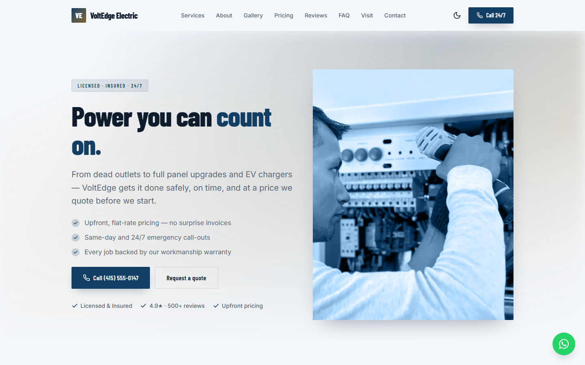
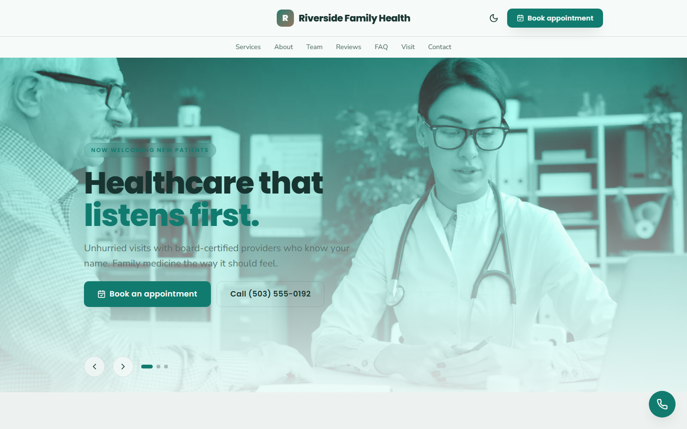
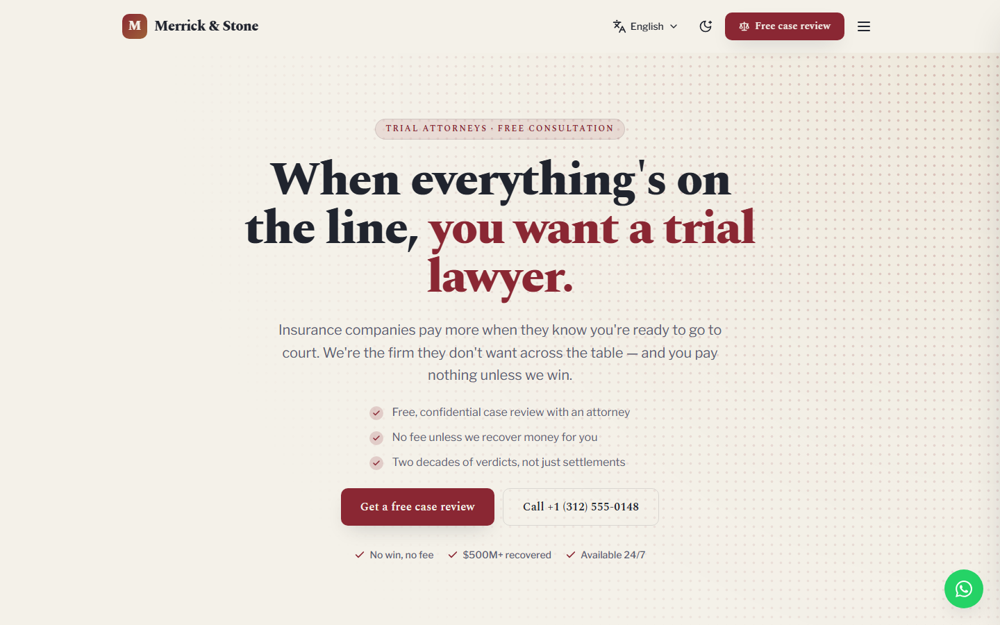
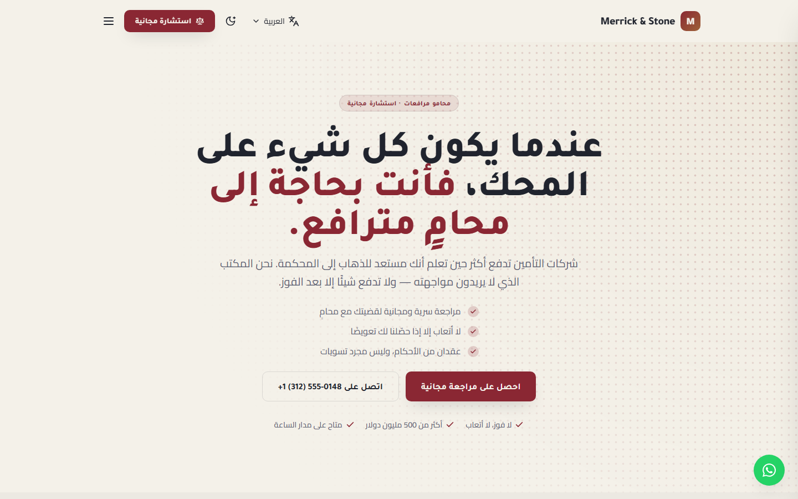

# Showcase Engine

A config-driven, multi-tenant website engine. **One codebase** renders any number of
distinct small-business websites — each defined by a **single configuration file**.
Colours, fonts, layout, section order, copy and language all change without touching a
line of engine code.

Adding a site means adding a value to a map. It does not mean adding a folder of code,
a theme, or a fork.

| Demo | Sector | Preset | Palette | Notable |
| --- | --- | --- | --- | --- |
| **VoltEdge Electric** | Electrician | `sharp` | steel navy + amber (light) · amber + cyan on graphite (dark) | dual light/dark with a toggle, plus a per-client hero override |
| **Riverside Family Health** | Family clinic | `soft` | healing teal + coral on warm white | light only, routed `/privacy` page |
| **Merrick & Stone** | Personal-injury law | `rounded` | ink + brass | trilingual EN/FR/AR, including full RTL |

The three share 100% of their code. Every difference between them lives in
`configs/<slug>.config.ts`.

> All business names, addresses, phone numbers and email addresses in these demos are
> fictional. The phone numbers use the reserved `555-01xx` range.

## The same codebase, three times

| | |
| :---: | :---: |
|  |  |
| **VoltEdge Electric** — `sharp` preset, split hero, dual palette | **Riverside Family Health** — `soft` preset, slider hero, centred header |
|  |  |
| **Merrick & Stone** — `rounded` preset, serif type, brass on ink | **The same page in Arabic** — mirrored layout, RTL type, LTR-isolated phone number |

Not three templates, and not three forks: one set of components reading three different
configuration files. The two Merrick shots are the same route, the same build and the same
components, differing only by `?lang=ar`.

### The photographs match the palette because the palette is applied to them

Every photograph is real, from [Pexels](https://www.pexels.com/license/), and free for
commercial use — sources recorded per file in
[`public/photos/CREDITS.md`](public/photos/CREDITS.md).

Stock photography arrives in whatever colours it was shot in, and a site is only as coherent
as its least matching image. Rather than hunting for photos that happen to suit three very
different palettes, `media.treatment: "tint"` applies the palette **to the photo**: the image
is desaturated and a `mix-blend-mode: color` layer puts `--primary` back, so the picture keeps
its own **luminance** — detail, depth, composition — and takes its **hue** from the theme.

The consequence worth noticing: the same photograph would come out steel navy on VoltEdge,
teal on Riverside and maroon on Merrick, without being edited. Swapping a photo later cannot
break the look, and sourcing stops being a colour-matching exercise.

A two-colour `duotone` was attempted and dropped rather than shipped looking wrong — see the
note on `MediaTreatment` in `lib/types.ts` for why CSS blend modes cannot express one.

**Where no photograph belongs, the art is generated from the config.** `npm run art` reads each
config's `colorsLight` and draws with those exact values — the theme system's idea applied to
assets. Composition is seeded from the file name, so output is deterministic and re-running
never churns the repo. It covers team monograms and any slot without a photo, and it is what
lets a brand-new client site be stood up and demonstrated before anyone has sourced a single
image.

**Team members stay monograms deliberately.** A generated pattern is plainly an illustration;
a stock photograph of a real person placed under an invented name is a different thing, and
this repository is public.

## Quick start

```bash
npm install
npm run dev
```

- `/` — the active site, selected by `NEXT_PUBLIC_ACTIVE_CLIENT`
- `/preview` — a gallery of every registered demo
- `/preview/[client]` — any single demo
- `/preview/presets` — the same sections rendered under all six style presets

Copy `.env.example` to `.env.local`; it documents every variable the engine reads. The
engine runs with **no environment variables at all** — contact submissions then log to
the console in development instead of being delivered.

## How it works

### One config = one whole site

`SiteConfig` (in `lib/types.ts`) is the single source of truth for a site: theme, business
details, section list, navigation, SEO, and delivery settings. `configs/index.ts` registers
each one in a map keyed by slug. That map is the entire multi-tenant mechanism.

```
request → resolve active config → localise → SiteRenderer → SectionRenderer → sections
```

### Configs are data

A config file contains only JSON-serialisable values — no constants, no template literals,
no computation. Copy refers to contact details through tokens (`{phone}`, `{emailHref}`,
`{siteName}`, …) which are expanded once at load time.

This is a deliberate constraint rather than a style preference. A value can be round-tripped
through a form, a database or an API; a program cannot. Keeping configs as pure data is what
would let a future editing UI write them back safely.

`{phone}` is emitted with Unicode bidi isolation, so a Latin phone number stays correctly
ordered inside Arabic copy — a bug that is invisible until you view the site in RTL.

### Registries, not conditionals

Sections, headers, footers and delivery channels all use the same three-part shape:

1. a **union type** naming the variants,
2. a **registry map** from name to implementation,
3. a **thin dispatcher** that looks one up.

Adding a section type, a header layout, a footer layout or a delivery channel is the same
three edits every time, and the type system fails the build if the registry is incomplete.
There is no `switch` statement growing a branch per client.

### Theme system

Themes are CSS custom properties scoped to a wrapper element, never to `:root` — which is
what allows several differently-themed sites to render on one page in `/preview` without
bleeding into each other. Six style presets control **geometry only** (radius, shadow,
transition, hover lift); colour comes exclusively from the palette.

Sites may define light and dark palettes and get a persisted, no-flash toggle.

Label colours are **computed rather than assumed**. `contrastRatio()` implements the WCAG
relative-luminance formula and `onColor()` picks a readable label for any filled surface,
preferring a palette colour that clears 4.5:1 before falling back to black or white. Star
ratings carry their own `--star` token because they need 3:1 as meaningful non-text — without
it, a brand accent has to be darkened everywhere just to serve as a rating colour.

### Contact delivery

Form submissions go to a server action that fans them out to a **pluggable adapter registry** —
the same shape as the section registry. Two channels ship: `email` (via Resend) and
`telegram`. A channel activates only when its environment variables are present, so
**secrets and targets are never stored in config**.

Delivery is best-effort across all active channels: enable several and the submission
succeeds if any of them accepts it. Honeypot and per-IP rate limiting run first. With no
channel configured the engine logs in development and reports an error in production — it
never silently drops an enquiry.

### Overrides

When one client genuinely needs bespoke markup, `overrides/active.ts` maps that client's slug
to a replacement component. The renderer checks the map and falls back to the shared default.
VoltEdge uses this for its hero. Nothing in `components/sections/` ever learns a client's name.

### Internationalisation

A site is authored once. `config.translations[locale]` is a **partial overlay** of only the
strings that change, with sections keyed by id. Locale resolves server-side from `?lang=`.
Per-locale fonts, `lang`/`dir` attributes, RTL mirroring and localised SEO metadata are all
handled. The default locale stays statically generated; other locales render on demand.

### SEO

Derived entirely from `business`, with no extra configuration: schema.org JSON-LD, a sitemap
built from the same config that defines the routes, `robots.txt`, and generated favicon and
Open Graph images drawn from the site's own palette and monogram.

## Quality gates

```bash
npm run typecheck
npm run lint
npm test
npm run build
```

All four run in CI on every push and pull request (`.github/workflows/ci.yml`).

The tests concentrate on failure modes that are **silent** — the ones that ship looking fine:

- a section type registered in the union but missing from the registry
- an icon name that renders as a blank glyph rather than throwing
- a mistyped delivery channel, which would lose enquiries with no error anywhere
- a translation overlay pointing at a section id that does not exist
- config values reaching markup unescaped (JSON-LD, scoped CSS, the inline theme script)
- a filled surface whose label falls below WCAG contrast

Security assertions check that **the attack fails** — that no live tag or extra CSS rule
appears in the output — rather than that some escape sequence is present. A test that looks
for `&lt;` passes happily on output that still executes.

Runtime configuration validation (`lib/validate-config.ts`, zod) catches shape errors and the
invariants that otherwise fail quietly. Every section is wrapped in an error boundary, so a
throwing section renders nothing in production instead of destroying the page.

## Tech stack

Next.js 16 (App Router) · React 19 · TypeScript · Tailwind CSS v4 · Vitest · zod

## Project layout

```
app/         routes, metadata, generated icon + OG images, server actions
components/  sections, headers, footers, shared UI primitives
  sections/  one component per section type
  headers/   header variants (registry)
  footers/   footer variants (registry)
lib/         engine: types, theme, i18n, tokens, SEO, nav, validation
  contact/   delivery framework + adapters
configs/     one file per site + the registry
overrides/   per-client component replacements
tests/       vitest suites
scripts/     artwork generator, section skeletons, Telegram chat-id helper
public/photos/  licensed photographs, one folder per site (+ CREDITS.md)
public/art/     generated artwork for slots without a photograph
```

## Deployment

Any host that runs Next.js. `NEXT_PUBLIC_ACTIVE_CLIENT` selects which config a given
deployment serves, so the same repository deploys as several independent sites — one project
per client, each with its own environment variables, domain and delivery channel.

---

**Note on history.** This repository is a public release of a project developed privately;
its full commit history lives in the private repository.

**All rights reserved.** This code is published for academic evaluation. It is not licensed
for reuse, redistribution or derivative works.
